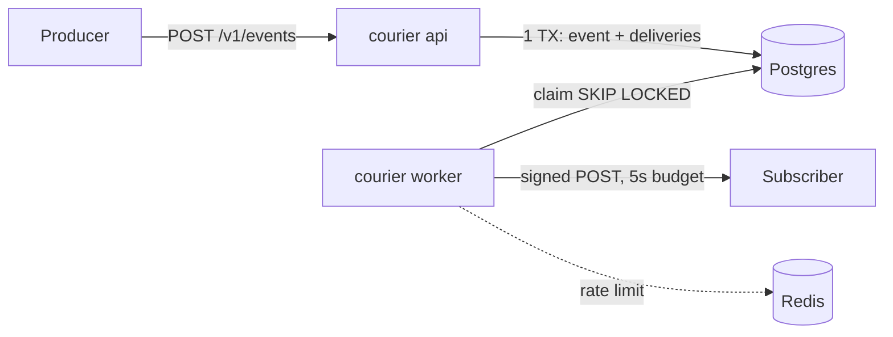

# courier-outbox

Reliable outbound webhook delivery: signed payloads, retries with backoff, idempotency keys, and a dead-letter queue, written in Go.

> **Status: DLQ list and replay.** The service has a schema, `courier migrate`, `courier keys create`, Bearer auth, `/healthz` + `/readyz`, subscription CRUD, transactional `POST /v1/events` with idempotency keys, and `courier worker`: SKIP LOCKED claims, v1 HMAC-signed POSTs, retries 1s → 5s → 25s → 2m → 10m, then `dead_lettered`. Operators can list deliveries (`GET /v1/deliveries`, including `status=dead_lettered`), inspect attempt history (`GET /v1/deliveries/:id`), and replay a dead letter (`POST /v1/deliveries/:id/replay`). Delivery is **at-least-once**, never exactly-once.

## Problem

Services that emit webhooks tend to reinvent the same fragile code: fire-and-forget POSTs, ad-hoc retries, no record of what was sent, secrets in logs, and endpoints that can be pointed at internal infrastructure. Subscribers then get duplicates they can't verify and miss events nobody noticed failing.

## Why courier-outbox

<!-- TODO(readme): expand into the case study once delivery ships. -->

- **Transactional enqueue.** `POST /v1/events` commits the event and its pending delivery rows together in Postgres (outbox pattern), so nothing accepted is ever lost. Duplicate `idempotency_key` values for the same API key replay as `200` with `Idempotent-Replay: true`.
- **Honest semantics.** Delivery is at-least-once, with a documented consumer contract, and never claims exactly-once. A crash after a successful POST and before the attempt is recorded can cause a duplicate send; consumers must dedupe.
- **Verifiable.** Every POST is HMAC-SHA256 signed with a per-subscription secret (scheme below).
- **Operable.** Each try is a `delivery_attempts` row. Failures retry 1s → 5s → 25s → 2m → 10m, then `dead_lettered`. Operators list the DLQ, inspect attempts, and replay. Health endpoints are live.
- **Safe by default.** Timeouts are strict (5s total), redirects are never followed, and signing secrets are encrypted at rest. Dial-time SSRF blocking is still limited: URL policy applies at subscription write.

## Stack

| Piece | Choice | Why |
|-------|--------|-----|
| Language | Go | Explicit concurrency, small static binary |
| HTTP | [chi](https://github.com/go-chi/chi) | stdlib-compatible handlers, route groups, middleware ([ADR 0002](docs/architecture/adr/0002-chi-router.md)) |
| System of record | PostgreSQL 16 | Outbox table + `FOR UPDATE SKIP LOCKED` workers ([ADR 0001](docs/architecture/adr/0001-postgres-outbox-with-redis-leases.md)) |
| Coordination | Redis 7 | Rate limits and advisory leases only, never durable state |
| Contract | OpenAPI 3 | [`openapi/openapi.yaml`](openapi/openapi.yaml) |
| Ops | Docker Compose, GitHub Actions, golangci-lint | |

## Architecture



The full design is in [`docs/architecture/`](docs/architecture/README.md): layering, error handling, transactionality, domain model, observability, external integrations, security, and testing.

## Run locally

```bash
cp .env.example .env          # optional; compose has local defaults
docker compose up --build
# migrate runs as a one-shot service and must exit 0 before api starts
curl localhost:8080/healthz   # {"status":"ok"}
curl localhost:8080/readyz    # {"status":"ready"}
KEY=$(docker compose run --rm --no-deps api keys create --name local | awk '/key:/{print $2}')
curl -i localhost:8080/v1/subscriptions
# 401 without Authorization
curl -s -H "Authorization: Bearer $KEY" -H 'Content-Type: application/json' \
  -d '{"target_url":"http://mock-subscriber:9090/hooks"}' \
  localhost:8080/v1/subscriptions
# 201 — copy signing_secret now; GET later omits it
curl -s -H "Authorization: Bearer $KEY" localhost:8080/v1/subscriptions
# Enqueue an event (201). Replay the same idempotency_key → 200 + Idempotent-Replay: true
curl -i -H "Authorization: Bearer $KEY" -H 'Content-Type: application/json' \
  -d '{"type":"order.created","payload":{"order_id":"1"},"idempotency_key":"enq-1"}' \
  localhost:8080/v1/events
curl -s -H "Authorization: Bearer $KEY" localhost:8080/v1/events/<event_id>
# After retries exhaust, list dead letters and replay one:
curl -s -H "Authorization: Bearer $KEY" 'localhost:8080/v1/deliveries?status=dead_lettered'
curl -s -H "Authorization: Bearer $KEY" localhost:8080/v1/deliveries/<delivery_id>
curl -i -X POST -H "Authorization: Bearer $KEY" localhost:8080/v1/deliveries/<delivery_id>/replay
```

Services: `migrate` (one-shot), `api` (:8080), `worker` (same image, `courier worker`), `db` Postgres (:5432), `redis` (:6379), and `mock-subscriber` (:9090, logs received webhooks including signature headers). After enqueue, the worker should POST a signed body to the mock within a few seconds.

Without Docker, against a running Postgres and Redis:

```bash
export DATABASE_URL REDIS_URL COURIER_API_KEY_PEPPER COURIER_ENCRYPTION_KEY   # see .env.example
go run ./cmd/courier migrate
go run ./cmd/courier keys create --name local
go run ./cmd/courier serve
# in another process:
go run ./cmd/courier worker
```

## Tests and CI

```bash
go test -race ./...
go test -race -tags=integration ./...   # needs Docker (testcontainers)
golangci-lint run
docker compose config -q
```

CI (GitHub Actions) runs lint, race-enabled unit tests, race-enabled integration tests (Postgres 16 + Redis 7 via testcontainers), binary build, compose validation, and image build.

## Worker and signature scheme

`courier worker` polls Postgres for due rows (`status` in `pending|retrying`, `next_attempt_at <= now()`, lease null or expired), claims them with `FOR UPDATE SKIP LOCKED`, and **commits before** the HTTP POST. Default lease is 30s (`WORKER_LEASE_TTL`). If the process dies, another worker reclaims after `lease_until`.

Each POST:

| Header | Value |
|--------|--------|
| `X-Courier-Idempotency-Key` | Event id (consumer dedupe key) |
| `X-Courier-Timestamp` | Unix seconds |
| `X-Courier-Signature` | `v1=<hex>` HMAC-SHA256 of `{timestamp}.{raw_body_bytes}` with the subscription signing secret |
| `User-Agent` | `courier-outbox/1.0` |

Timeouts: dial 2s, TLS handshake 2s, total 5s. At most 8 KiB of the response is read. Redirects are not followed (3xx is a failed attempt). Non-2xx / timeout / network error increments `attempt_count` and schedules the next try; the sixth failure marks `dead_lettered`.

`COURIER_BACKOFF_MS` is a **test-only** override that replaces every production delay with that many milliseconds. Do not set it in real environments.

## Consumer responsibilities

1. Verify `X-Courier-Signature` (`v1=` + hex HMAC-SHA256 over `{timestamp}.{raw body}`) and reject timestamps more than **5 minutes** from your clock.
2. Treat delivery as **at-least-once**. Dedupe on `X-Courier-Idempotency-Key` (the event id). Courier does **not** provide exactly-once delivery.
3. Return 2xx only after you have durably accepted the event.
4. Respond within the 5s budget; process heavy work asynchronously.

Operators: deliveries that still fail after six attempts are `dead_lettered`. List them with `GET /v1/deliveries?status=dead_lettered`, inspect `GET /v1/deliveries/:id` (append-only attempts), and `POST /v1/deliveries/:id/replay` to put a dead letter back to `pending` without erasing history. Replay of any other status is `409 invalid_transition`.

## Trade-offs

Courier chooses at-least-once over exactly-once: the claim transaction never stays open across the subscriber POST, so a crash between a 2xx and the record step can send the event again. Consumers must verify signatures and dedupe. Workers poll `next_attempt_at` rather than LISTEN/NOTIFY. Redis is not the source of truth for leases.

## Contributing

Work is spec-driven. Read [`AGENTS.md`](AGENTS.md), then [`openspec/README.md`](openspec/README.md). Commits follow Conventional Commits.

## License

[MIT](LICENSE) © Christian Agila
