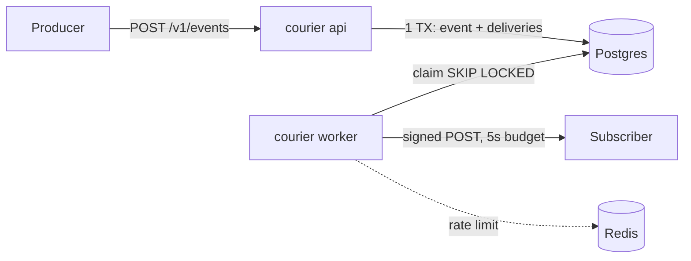

# courier-outbox

Reliable outbound webhook delivery: signed payloads, retries with backoff, idempotency keys, and a dead-letter queue, written in Go.

> **Status: persistence and API keys.** The scaffold now has a schema, `courier migrate`, `courier keys create`, Bearer auth on `/v1`, and `/healthz` + `/readyz`. Enqueue, delivery, signing, and the DLQ are **not implemented yet**. They land one OpenSpec change at a time (see [`openspec/specs/README.md`](openspec/specs/README.md)).

## Problem

Services that emit webhooks tend to reinvent the same fragile code: fire-and-forget POSTs, ad-hoc retries, no record of what was sent, secrets in logs, and endpoints that can be pointed at internal infrastructure. Subscribers then get duplicates they can't verify and miss events nobody noticed failing.

## Why courier-outbox

<!-- TODO(readme): expand into the case study once delivery ships. -->

These are design goals. They are specified but not built yet.

- **Transactional enqueue.** The event and its delivery rows commit together in Postgres (outbox pattern), so nothing accepted is ever lost.
- **Honest semantics.** Delivery is at-least-once, with a documented consumer contract, and never claims exactly-once.
- **Verifiable.** Every POST is HMAC-SHA256 signed with a per-subscription secret.
- **Operable.** It keeps an attempt log, a retry schedule of 1s → 5s → 25s → 2m → 10m, a queryable DLQ with replay, metrics, and health endpoints.
- **Safe by default.** SSRF guards check target URLs and dialed IPs, timeouts are strict, redirects are never followed, and signing secrets are encrypted at rest.

## Stack

| Piece | Choice | Why |
|-------|--------|-----|
| Language | Go | Explicit concurrency, small static binary |
| HTTP | [chi](https://github.com/go-chi/chi) | stdlib-compatible handlers, route groups, middleware ([ADR 0002](docs/architecture/adr/0002-chi-router.md)) |
| System of record | PostgreSQL 16 | Outbox table + `FOR UPDATE SKIP LOCKED` workers ([ADR 0001](docs/architecture/adr/0001-postgres-outbox-with-redis-leases.md)) |
| Coordination | Redis 7 | Rate limits and advisory leases only, never durable state |
| Contract | OpenAPI 3 | [`openapi/openapi.yaml`](openapi/openapi.yaml) |
| Ops | Docker Compose, GitHub Actions, golangci-lint | |

## Architecture



The full design is in [`docs/architecture/`](docs/architecture/README.md): layering, error handling, transactionality, domain model, observability, external integrations, security, and testing.

## Run locally

```bash
cp .env.example .env          # optional; compose has local defaults
docker compose up --build
# migrate runs as a one-shot service and must exit 0 before api starts
curl localhost:8080/healthz   # {"status":"ok"}
curl localhost:8080/readyz    # {"status":"ready"}
docker compose run --rm --no-deps api keys create --name local
curl -i localhost:8080/v1/subscriptions
# 401 {"code":"unauthorized",...}
```

Services: `migrate` (one-shot), `api` (:8080), `db` Postgres (:5432), `redis` (:6379), and `mock-subscriber` (:9090, logs received webhooks).

Without Docker, against a running Postgres and Redis:

```bash
export DATABASE_URL REDIS_URL COURIER_API_KEY_PEPPER   # see .env.example
go run ./cmd/courier migrate
go run ./cmd/courier keys create --name local
go run ./cmd/courier serve
```

## Tests and CI

```bash
go test -race ./...
go test -race -tags=integration ./...   # needs Docker (testcontainers)
golangci-lint run
docker compose config -q
```

CI (GitHub Actions) runs lint, race-enabled unit tests, race-enabled integration tests (Postgres 16 + Redis 7 via testcontainers), binary build, compose validation, and image build.

## Consumer responsibilities

<!-- TODO(readme): finalize with the delivery change (FR-DOC-001). -->

1. Verify `X-Courier-Signature` and reject timestamps more than 5 minutes old.
2. Expect duplicates and dedupe on `X-Courier-Idempotency-Key`.
3. Return 2xx only after you have durably accepted the event.
4. Respond quickly, and process heavy work asynchronously.

## Trade-offs

<!-- TODO(readme): at-least-once vs exactly-once, polling vs LISTEN/NOTIFY, Redis optionality. -->

## Contributing

Work is spec-driven. Read [`AGENTS.md`](AGENTS.md), then [`openspec/README.md`](openspec/README.md). Commits follow Conventional Commits.

## License

[MIT](LICENSE) © Christian Agila
