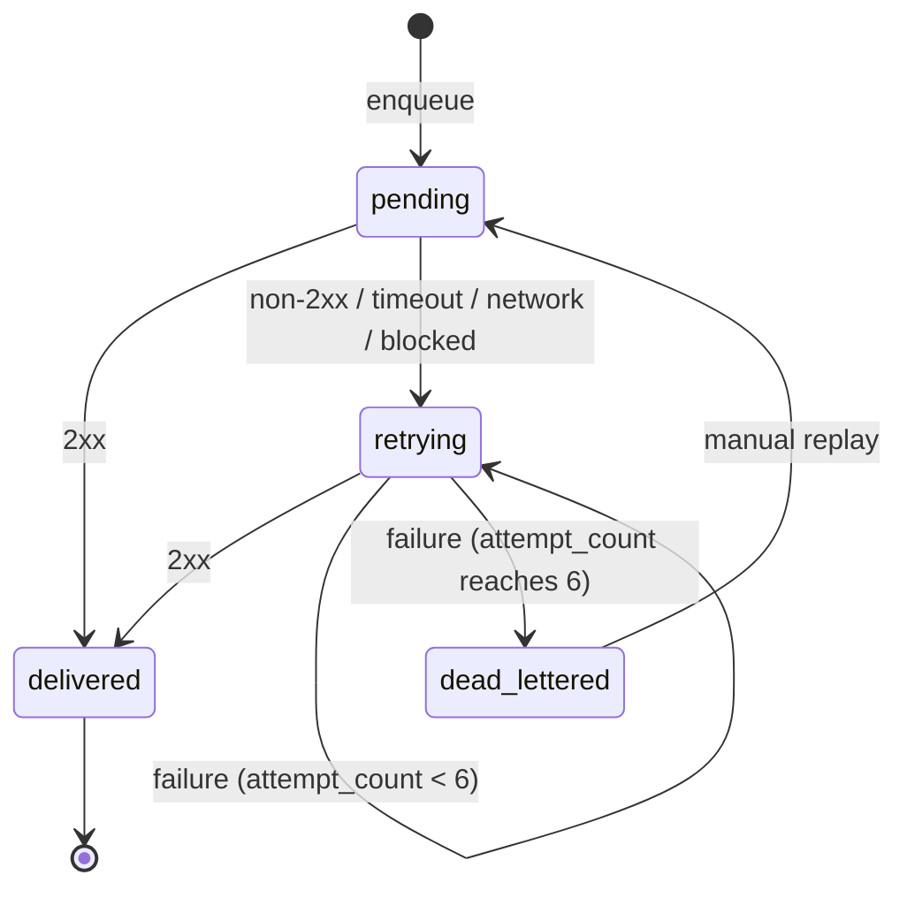

# Domain model

`internal/domain` is pure Go: no I/O, no SQL, no HTTP, no logging. Everything here is unit-tested without containers.

## Vocabulary

| Term | Meaning |
|------|---------|
| **Producer** | Machine client identified by an API key. It owns subscriptions and events. |
| **APIKey** | `id`, `name`, `prefix` (displayable), `key_hash`, `revoked_at`. The raw key is never stored. |
| **Subscription** | Target URL + event-type filter (`["*"]` = all) + enabled flag + optional static headers + encrypted signing secret. |
| **Event** | Immutable fact from a producer: `type`, JSON `payload` (≤ 256 KiB), `idempotency_key`, `occurred_at`. |
| **Delivery** | The path of one event to one subscription. It carries status, `attempt_count`, `next_attempt_at`, and lease fields. |
| **Attempt** | One HTTP POST try: status code or error, duration, request id. Append-only. |
| **Lease** | A time-bounded claim (`lease_owner`, `lease_until`) so only one worker processes a delivery. |
| **DLQ** | The set of deliveries in `dead_lettered`. They are queryable and replayable. |

## Aggregates and ownership

- **Tenant boundary:** every Subscription and Event belongs to exactly one `api_key_id`. Cross-tenant access is impossible through the API. Queries always filter by `api_key_id`, and a foreign id returns `ErrNotFound` (not "forbidden"), so ids can't be probed.
- **Event** is created once and never mutated.
- **Delivery** is the consistency boundary for retries. Its status, attempt count, and lease change together in one fenced update.
- **Attempt** rows are never updated or deleted by application code. Only the retention purge removes them.

## Invariants (enforced in constructors *and* DB constraints)

- `idempotency_key` is 1–128 chars, unique per `api_key_id`.
- `event.type` is non-empty, ≤ 128 chars, and matches `^[a-z0-9]+([._-][a-z0-9]+)*$` (to be confirmed in the enqueue change).
- `target_url` is absolute http(s), has no userinfo, and passes the SSRF policy when enabled.
- `event_types` is non-empty. `"*"` must appear alone.
- `attempt_count` never decreases. Replay does not reset it.
- A `delivered` delivery is terminal.

Constructors (`NewEvent`, `NewSubscription`, `ParseIdempotencyKey`, …) return `(T, error)` and wrap `ErrValidation` with a field-level cause. The zero value of a domain type is never treated as valid input.

## Delivery state machine

"In flight" is **not** a status. It is represented by an unexpired lease. That keeps crash recovery trivial: an expired lease on a `pending` or `retrying` row means the row is due again.

Transitions are domain functions, e.g. `func (d Delivery) OnAttempt(outcome Outcome, now time.Time) (Delivery, error)`. They return `ErrInvalidTransition` for illegal moves.

## Backoff schedule (FR-DEL-005)

| `attempt_count` after failure | Next delay |
|-------------------------------|------------|
| 1 | 1s |
| 2 | 5s |
| 3 | 25s |
| 4 | 2m |
| 5 | 10m |
| 6 | dead-letter |

Implement it as a table (`[]time.Duration`), not arithmetic. It is overridable **only** in tests via `COURIER_BACKOFF_MS` / an injected schedule. The domain returns a `time.Duration`, and the store applies it relative to the database clock (`now() + $delay`).

## Types and representation

- Domain structs carry **no** `json:` or `db:` tags. `api` has its own DTOs and `store` has its own row structs (or sqlc models), with explicit mapping functions.
- Use typed identifiers (`type EventID string`, or UUID wrappers) so `SubscriptionID` and `DeliveryID` can't be swapped silently.
- Use enums as typed strings with an explicit set: `type DeliveryStatus string` plus consts and `Valid()`.
- Times are `time.Time` in UTC. Durations are `time.Duration`, never bare ints.
