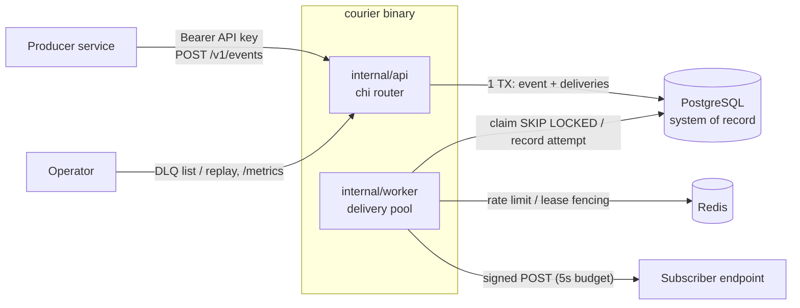

# Overview

## Context

A single `courier` binary serves the API and can run the worker in the same process (for the Compose demo) or on its own (`courier worker`). Both modes use the same packages.

## Components

| Package | Responsibility |
|---------|----------------|
| `cmd/courier` | Composition root. It parses the subcommand, loads config, builds dependencies, wires the router and worker, and handles signals. It contains no business logic. |
| `internal/config` | Env → validated `Config`, failing fast at startup. |
| `internal/api` | HTTP transport: routing, auth middleware, DTOs, validation calls, error → HTTP mapping. |
| `internal/domain` | Pure model: entities, invariants, status transitions, backoff schedule, sentinel errors. |
| `internal/store` | Postgres and Redis adapters. Owns SQL and transaction boundaries. |
| `internal/worker` | Claim loop, worker pool, outbound HTTP client, attempt recording, retry scheduling. |
| `internal/sign` | v1 HMAC-SHA256 signer and verifier (stdlib only). |
| `cmd/mock-subscriber` | Local demo target. Never deployed. |
| `migrations/` | Forward-only SQL. |
| `openapi/` | Committed OpenAPI 3 contract. It is served at `/openapi.json` once implemented. |

## Enqueue flow (planned, FR-EVT-001)

1. The API authenticates the Bearer key and resolves `api_key_id`.
2. The handler decodes the body (256 KiB cap) and validates it via domain constructors.
3. The store runs a single transaction. It inserts the event with `ON CONFLICT (api_key_id, idempotency_key) DO NOTHING`. On conflict it loads the existing event and marks the response as a replay. Otherwise it inserts one `pending` delivery per matching enabled subscription, with `next_attempt_at = now()`.
4. The API responds `201` with `{event_id, delivery_ids}`, or `200` plus `Idempotent-Replay: true`.

## Delivery flow (planned, FR-DEL-001..007)

1. **Claim (short TX).** Select due rows `FOR UPDATE SKIP LOCKED LIMIT N`, set `lease_owner` and `lease_until`, and commit.
2. **Send (no TX open).** Build the body, sign it, and POST through the hardened client with a 5s budget.
3. **Record (short TX, fenced).** Insert the attempt, then update the delivery `WHERE id = $1 AND lease_owner = $2`. A 2xx marks it `delivered`. Anything else sets `retrying` with `next_attempt_at = now() + backoff(attempt_count)`, or `dead_lettered` once retries are exhausted.
4. If the worker dies mid-flight, the lease expires (30s) and another worker reclaims the delivery. That is why delivery is **at-least-once**.

## Queue decision

Postgres is the durable outbox and Redis is an accelerator. Losing Redis never loses a delivery. See [ADR 0001](adr/0001-postgres-outbox-with-redis-leases.md).
